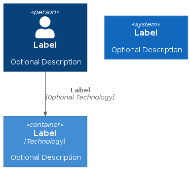

# c4-plantuml-docker

[](https://github.com/fsmiamoto/c4-plantuml-docker/actions/workflows/gen.yaml)

Template repository with Docker based flows for generating architectural diagrams using
[PlantUML](https://github.com/plantuml/plantuml) and the [C4-PlantUML](https://github.com/plantuml-stdlib/C4-PlantUML)

It includes a CD workflow that generates and archives diagrams on every push to master.

## Locally

```
$ vim diagrams/hello.puml
$ make gen PLANTUML_FLAGS=-tpng # Generate PNGs, SVGs are generated by default
```


